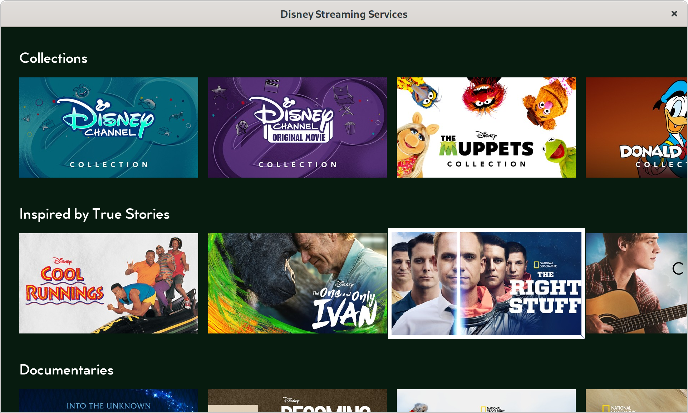

# Disney Streaming Services (DSS) Main Menu

Main menu for a DSS-inspired streaming media application, written in Rust.



## Getting started

To build this project on Windows, macOS, or Linux, you will need a recent
version of the [Rust toolchain](https://www.rust-lang.org/) at least version
1.46.0, at minimum, but versions 1.48.0 and newer are strongly recommended
because they perform better with async code ([rust-lang/rust#78410]).

[rust-lang/rust#78410]: https://github.com/rust-lang/rust/pull/78410

If [`rustup`](https://rustup.rs/) is available on your system, the included 
[`rust-toolchain`](./rust-toolchain) file at the root directory of this
repository should automatically fetch and install the Rust toolchain for you, if
not already present on your system, as soon as you execute any `cargo` command
in the shell.

The following external dependencies will also be required on your system:

* [SDL2], for system window and render context management, input handling, and
  hardware-accelerated rendering.
* [SDL2_image], for loading arbitrary image files as SDL textures.
* [SDL2_ttf], for loading and rendering TrueType fonts as SDL textures.

[SDL2]: https://www.libsdl.org/
[SDL2_image]: https://www.libsdl.org/projects/SDL_image/
[SDL2_ttf]: https://www.libsdl.org/projects/SDL_ttf/

### Windows (MSVC with vcpkg)

```bat
vcpkg.exe install sdl2:x64-windows sdl2-image:x64-windows sdl2-ttf:x64-windows
```

### macOS

```bash
brew install sdl2 sdl2_image sdl2_ttf
```

### Linux

```bash
# Ubuntu/Debian
sudo apt install libsdl2 libsdl2-image libsdl2-ttf

# Arch Linux
sudo pacman -Sy sdl2 sdl2_image sdl2_ttf
```

## Compiling

To compile the application in release mode and start it, simply run this command
in your terminal:

```bash
cargo run --release
```

To execute the included unit test suite, run:

```bash
cargo test
```

To generate HTML documentation for the public crate API, run:

```bash
cargo doc --open
```

## Usage

The input controls for navigating the UI are listed below:

Action            | Controls
------------------|-------------------------------------------------------------
Navigate menu     | <kbd>↑</kbd>, <kbd>↓</kbd>, <kbd>←</kbd>, <kbd>→</kbd>
Toggle fullscreen | <kbd>F11</kbd>
Close window      | <kbd>Esc</kbd> or "close" button

## Project layout

Like many idiomatic Rust projects, this service is split into a binary crate
(the `main.rs` file) and a library crate (`lib.rs` and the rest). This is to
facilitate simpler unit and integration testing under Cargo, should we require
more of it in the future.

The `main.rs` is a very thin shim over `dss_menu::app::App`, which manages the
main loop, UI rendering, and drives the `dss_menu::menu::Menu` business logic
forward.

There is also a single background I/O thread for fetching arbitrary files over
HTTP and caching them in the OS temp directory, which is spawned on app startup;
the implementation for this is located in `src/fetcher.rs`. This thread can
process many async HTTP downloads concurrently without resorting to spawning one
thread per connection, and sends completed files back to the main thread as they
become available.

The JSON schema `serde` types are located in `src/schema.rs` and its submodules.

## Assumptions

* This application will run on an OS with a system allocator available.

* This class of application is optimized for mobile devices or smart TVs, and as
  such should try to eliminate heap allocation and dynamic dispatch where
  possible, and also put the CPU to sleep when applicable to consume less power.

* This application will fetch and stream resources from the Internet as they
  become available while avoiding blocking the main loop, and may require some
  form of async concurrency in order to scale efficiently without spawning more
  than two OS threads, one for the application and another for network I/O.

* Cached files will not persist in between individual runs of the application.

## Possible improvements

* Dynamically populate ref sets as they scroll into view (didn't quite have time
  to build a widget or callback for that). We are capable of parsing this data,
  though, since the schema types exist.

* Draw rectangular cursor of selected menu tile with rounded corners.

* Implement animations by passing the delta time between frames to
  `Widget::update()` and using linear interpolation in `Menu::select_tile()` to
  gradually select and deselect tiles.

* Load the video art MP4 files for use as background animations for the
  currently selected tile.

* Skip the SDL hardware-accelerated rendering context and offload even more
  rendering computations from the CPU to the GPU.

* Cache individually rendered TTF glyphs as SDL textures to make repeated text
  rendering faster, a la [grimfang4/SDL_FontCache].

* Find (or write) an alternative async executor which allows for explicit
  handling of out-of-memory errors.

* Try to reduce heap allocations by using `serde` in zero-copy deserialization
  mode and adding a lifetime to the `home.json` AST (thereby using `&str` over
  `String` when possible).

* Perhaps the number of `String` and `Url` copies made during file fetching and
  polling could be reduced by sending references instead of values over the
  channel, but this would be really tedious to implement due to lifetimes, to
  say the least.

* Add text logging and/or profiling with [Criterion.rs] and `cargo bench`.

## Third-party Rust libraries

* `anyhow` is used to eliminate boilerplate from error handling. This commonly
   used crate eliminates the need to create your own error struct or enum for
   application-type Rust projects (as opposed to library-type projects) and
   reduces the number of manual implementations of `Debug`, `Display`, `From`,
   and `std::error::Error` as well as conversions between them.

* `flume` is a MPMC channel library that fixes numerous bugs and deficiencies
  seen in `std::sync::mpsc`, and most notably works with mixed sync/async code.
  This library is used for passing data between the synchronous rendering thread
  and the asynchronous background I/O thread without blocking the main loop.

* `fnv` provides a faster and cheaper hashing algorithm than the Rust standard
  library, which is intended to be DoS resistant by default. We don't need this
  protection for local rendering uses, though, and `fnv` performs _way_ better
  during hot loops where map accesses and inserts are frequent.

* `futures-util` contains common async traits not yet available in the Rust
  standard library (e.g. `FutureExt`, `StreamExt`, and so on) as well as the
  `Abortable` combinator and `poll_fn()` function used in tests.

* `sdl2` provides native Rust bindings to SDL 2.0, as well as `SDL_image` and
  `SDL_ttf` for image loading and font rendering, respectively.

* `serde` and `serde_json` provide JSON deserialization with pretty good
  performance for consuming the DSS `home.json` API.

* `reqwest` is an async HTTP client used for fetching JSON and image files from
  the DSS API while the main thread is busy rendering. It happens to include
  `rustls` as an optional statically-linked pure Rust alternative to OpenSSL,
  which is nice because it eliminates one more runtime dependency and
  [uses less memory].

* `tempfile` is used for locating the OS temporary directory and creating
  temporary files that delete themselves after dropping, a facility not provided
  by the Rust standard library.

* `tokio` is used to spawn multiple async tasks and join them concurrently while
  using minimal resources. Although Rust provides zero-cost async (in the C++
  sense), it does not include an executor in the standard library to drive those
  futures, requiring users to choose one from Crates.io or write their own
  instead. This crate is compiled in single-threaded mode to stay lightweight.

* `url` is used for parsing URL values from strings, both at deserialization
  time and for use with `reqwest`.

* `uuid` is used only for type-safety while deserializing UUIDs from JSON.

[uses less memory]: https://jbp.io/2019/07/01/rustls-vs-openssl-performance.html
[grimfang4/SDL_FontCache]: https://github.com/grimfang4/SDL_FontCache
[Criterion.rs]: https://bheisler.github.io/criterion.rs/book/criterion_rs.html

## Credits

Includes the [Cocogoose Pro] TrueType font family, which is free for personal
use.

[Cocogoose Pro]: https://www.1001fonts.com/cocogoose-pro-font.html
